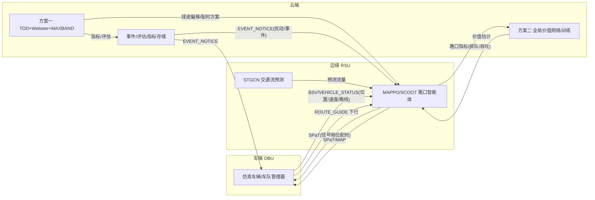

# 云-边-端协同架构与数据流

## 1. 三层架构

```
┌──────────────────────────────────────────────────────────────┐
│ 前端展示层（Vue3 + MapLibre + deck.gl + ECharts，团队他人负责） │
│  REST API /api/v1  +  WebSocket 实时推送（车辆/信号灯/指标）   │
└───────────────┬──────────────────────────┬───────────────────┘
                │ REST                     │ WebSocket
┌───────────────▼──────────────────────────▼───────────────────┐
│ 云端 · 集中决策中枢（FastAPI 服务层）                          │
│  - 方案一：TOD 调度 / Webster 集中配时 / MAXBAND 全局绿波       │
│  - 方案二：全局状态聚合、MAPPO 价值网络与离线训练               │
│  - 全局指标统计、基准评估、历史存储、事件全局通告               │
└───────────────┬──────────────────────────────────────────────┘
                │ V2X 通信模拟（消息 + 延迟/丢包，传输层可替换）
┌───────────────▼──────────────────────────────────────────────┐
│ 边缘 · RSU 路口智能体（仿真内嵌，每路口一个 agent）             │
│  - 方案二：SCOOT 自适应控制器（主控，本地观测→本地动作）        │
│  - STGCN 短时交通流预测（路口/边级）                           │
│  - MAPPO 强化学习（已通过验收，actuated"保持/推进" + 变灯倒计时） │
│  - 方案一：Webster 各路口实时流量采集与本地重算                 │
└───────────────┬──────────────────────────────────────────────┘
                │ V2X 通信模拟
┌───────────────▼──────────────────────────────────────────────┐
│ 车端 · OBU（仿真车辆 / 车队管理器）                            │
│  - 方案三：车队识别、动态路线引导（Dijkstra + K短路 + 负载均衡）│
│  - 车辆状态上报（位置/速度/路线）上行                          │
│  - 接收下行指令（路线变更/建议车速/信号配时预告）               │
└───────────────┬──────────────────────────────────────────────┘
                │ TraCI（独立线程）
┌───────────────▼──────────────────────────────────────────────┐
│ 仿真引擎层 SUMO ≥1.18（20 路口雄安容东片区路网）               │
└──────────────────────────────────────────────────────────────┘
```

## 2. 车-路-云数据流



## 3. V2X 消息类型

| 类型 | 方向 | 内容 |
|---|---|---|
| BSV | 车→边/云 | 基本安全（位置/速度/方向） |
| VEHICLE_STATUS | 车→云 | 车辆状态上报 |
| SPaT | 边→车 | 信号相位与配时 |
| MAP | 边→车 | 路口拓扑 |
| ROUTE_GUIDE | 云→车 | 路线引导指令 |
| EVENT_NOTICE | 云→边/车 | 事件通告 |

通信经 `app/comms`（V2XHub + SimulatedTransport）模拟延迟/丢包；传输层抽象为 `Transport` 接口，演示彩蛋可替换为 SocketTransport（真多机）。

## 4. 标准化接口价值

云-边-车接口与消息格式经本架构固化，可作为《协同管控系统测试规程》地方标准的接口规范参考。
