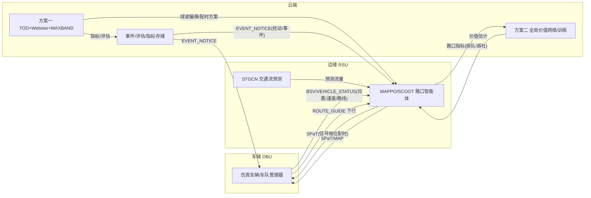

# 云-边-端协同架构与数据流

## 1. 三层架构

> 前端为本项目自研渲染（Canvas 自绘路网 + ECharts 指标），非第三方地图框架。

```
┌──────────────────────────────────────────────────────────────┐
│ 前端展示层（Vue3 + Canvas 自绘 + ECharts + WebSocket）         │
│  REST API /api/v1  +  WebSocket 实时推送（车辆/信号灯/指标）   │
└───────────────┬──────────────────────────┬───────────────────┘
                │ REST                     │ WebSocket
┌───────────────▼──────────────────────────▼───────────────────┐
│ 云端 · 集中决策中枢（FastAPI 服务层 AppRuntime）               │
│  - 方案一：TOD 调度 / Webster 集中配时 / MAXBAND 全局绿波       │
│  - 方案二：全局状态聚合、MAPPO 训练/全局价值、STGCN 全局预测     │
│  - LLM 智能体（态势感知→跨区调度指令，走算法配置接口）          │
│  - 全局指标统计、评分评估、历史存储、报告导出、事件全局通告      │
└───────────────┬──────────────────────────────────────────────┘
                │ V2X 通信模拟（消息 + 延迟/丢包，传输层可替换）
┌───────────────▼──────────────────────────────────────────────┐
│ 边缘 · RSU 路口智能体（仿真内嵌，每路口一个，本地观测→本地动作） │
│  - 方案一：Webster 各路口本地流量采集与重算                    │
│  - 方案二：SCOOT 本地自适应（降级） / MAPPO 路口策略（分布执行）│
│  - STGCN 短时交通流预测（路口/边级）                           │
│  - conflict.py 本地冲突/安全校验（防溢出、右转常绿等路侧逻辑）   │
└───────────────┬──────────────────────────────────────────────┘
                │ V2X 通信模拟
┌───────────────▼──────────────────────────────────────────────┐
│ 车端 · OBU（仿真车辆 / 车队管理器）                            │
│  - 方案三：车队识别、动态路线引导（Dijkstra + K短路 + 负载均衡）│
│  - 节能/通行驾驶建议（建议车速、前方拥塞提示）                 │
│  - 车辆状态上报（位置/速度/路线）上行                          │
│  - 接收下行指令（路线变更/建议车速/信号配时预告）               │
└───────────────┬──────────────────────────────────────────────┘
                │ TraCI（独立线程）
┌───────────────▼──────────────────────────────────────────────┐
│ 仿真引擎层 SUMO ≥1.18（20 路口 窄路密网格网 路网）             │
└──────────────────────────────────────────────────────────────┘
```

## 2. 车-路-云数据流



## 3. V2X 消息类型

| 类型 | 方向 | 内容 |
|---|---|---|
| BSV | 车→边/云 | 基本安全（位置/速度/方向） |
| VEHICLE_STATUS | 车→云 | 车辆状态上报 |
| SPaT | 边→车 | 信号相位与配时 |
| MAP | 边→车 | 路口拓扑 |
| ROUTE_GUIDE | 云→车 | 路线引导指令 |
| EVENT_NOTICE | 云→边/车 | 事件通告 |

通信经 `app/comms`（V2XHub + SimulatedTransport）模拟延迟/丢包；传输层抽象为 `Transport` 接口，可替换为 SocketTransport（真多机）。

## 4. 实现落点（代码映射）

| 架构角色 | 本仓库实现 | 关键文件 / 接口 |
| --- | --- | --- |
| 云端 · 决策/数据中枢 | FastAPI `AppRuntime`（全局状态、评分、历史、报告、事件、LLM） | `app/core/runtime.py`、`app/api/*`、`app/eval/scoring.py`、`app/report/` |
| 云端 · 算法配置面 | 标准化算法接口（统一挂载/观测/参数） | `GET/POST /api/v1/algorithms*`、`app/algorithms/` |
| 云端 · 高层协调 | LLM 智能体（态势→跨区调度，调 configure_algorithm/action） | `app/agent/` |
| 边缘 · 路口智能体 | 方案一/方案二控制器（每路口本地决策） | `app/schemes/scheme1/`、`scheme2/` |
| 边缘 · 安全/冲突 | 路侧本地校验（右转常绿、防溢出安全网） | `app/core/conflict.py`、`safety_net.py`、`right_turn_link_indices` |
| 边缘 · 预测 | STGCN 短时流量预测（无权重时 EWMA 规则兜底） | `app/schemes/scheme2/stgcn.py` |
| 车端 · 引导/建议 | 方案三车队动态重路由 + 车辆驾驶/节能建议 | `app/schemes/scheme3/`、`GET /vehicles/{id}/advice` |
| V2X 通信 | 消息（BSV/SPaT/MAP/VEHICLE_STATUS/ROUTE_GUIDE/EVENT_NOTICE）+ 传输抽象 | `app/comms/` |

**部署约束假设**（对应赛题"现有车规级芯片算力与通信带宽约束"）：
- 云端重决策低频（TOD/绿波/事件级，秒~分钟级）；边缘（RSU/路口）中频（秒级，SCOOT/MAPPO 5s 决策周期）；车端高频（车辆步进由 SUMO 驱动）。
- 上行仅状态摘要（位置/速度/排队聚合），下行仅指令（配时/路线/建议车速），不传全量轨迹 → 通信带宽需求低。
- 模型轻量化：MAPPO Actor 仅 2 层 MLP（ONNX/int8 导出），STGCN 图卷积小网络，均可在 CPU/车规级推理。

## 5. 标准化接口价值

云-边-车接口与消息格式经本架构固化（含上面的实现落点映射），可作为《协同管控系统测试规程》地方标准的接口规范参考。
