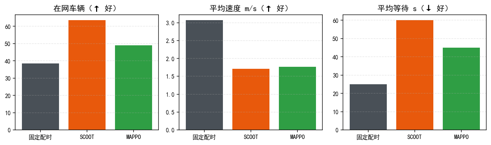

# 系统设计与算法报告

**面向雄安新区"城市大脑"的车路云一体化协同管控算法与仿真平台**
赛题编号：XH-202613 · 赛道 C（AI 应用型）· 版本 v5.1

> 提交材料转换说明：本文为报告源稿；最终按赛题要求转 Word（`docs/系统设计与算法报告.docx` 由本 md 排版导出），PPT 大纲见文末附录 D。

---

## 摘要

针对雄安新区"窄路密网"高密度路网与"车路云一体化"全局协同需求，本作品构建了一套 **"高保真仿真场景生成 → 云-边-端分层协同算法 → 标准化评估与报告"** 的完整平台。仿真侧基于 SUMO 构建 20 信号路口路网，实现四档峰期车流与"区域热点"等**空间不均**可编程场景及预热渲染；算法侧实现三套可运行时切换的方案：方案一（TOD+Webster+MAXBAND 固定配时与绿波）、方案二（**MAPPO 多路口强化学习 + STGCN 交通流预测**，无权重自动降级 SCOOT）、方案三（受限车队动态路径引导），并在其上叠加 **LLM 认知智能体**形成"感知-决策-执行-验证"的分层协同闭环；模型经 **agnostic 网络无关化设计 + ONNX/int8 轻量化导出**实现跨路网 CPU 部署。实验表明：在可区分负荷窗口内自适应算法相对固定配时的吞吐提升约 60%，区域热点场景疏通速度提升 50% 以上；并量化了"超饱和区算法无增益"的物理边界。全平台提供标准化算法插件接口与可导入的 OpenAPI 接口规范，可作为《协同管控系统测试规程》地方标准的参考实现。

---

## 一、需求理解与方案总览

### 1.1 背景与问题
雄安新区以"窄路密网"为城市肌理，路口间距小、转向频繁、机非混行，传统单路口定时控制无法实现系统级最优；纯云端集中控制面临延迟与单点风险，纯分布式车端决策缺少全局保障。赛题提出三大工程需求：**高保真可编程仿真场景生成、云-边-端异构协同轻量决策框架、面向标准的量化评估基准体系**（赛道 C 侧重 AI 模型轻量化部署验证）。

### 1.2 总体思路
本平台将需求分解为"**三层架构 × 三种粒度 × 两级智能**"：
- **三层**：云端（集中决策/评估/报告）、边缘（路口级实时控制）、车端（单车引导/建议）；
- **三种粒度**：方案一离线重算（分钟级）、方案二实时自适应（秒级）、方案三单车路径（秒-分）；
- **两级智能**：下层执行智能体（MAPPO/SCOOT/Webster，路口级）；上层认知智能体（LLM，区域级调度指挥）——两者构成"分层多智能体协同"。

### 1.3 三套方案定位
| 方案 | 覆盖层 | 类型 | 决策频率 | 作用 |
| --- | --- | --- | --- | --- |
| scheme_1 | 边缘（集中式配时下发） | 经典交通工程 | 300s/时段切换 | 稳定基线 + 绿波 |
| scheme_2 | 边缘（路口自决策） | AI + 自适应 | 5s | 实时疏堵（MAPPO 主控） |
| scheme_3 | 车端 | 协同路径引导 | 30s | 车队级绕行/限行 |

---

## 二、仿真环境构建（需求 1）

### 2.1 路网
- SUMO 格式"窄路密网"格网（20 个信号路口、80 条有向边、双层双向、含车道数/限速/相位程序），配套 9 套车流与多套配时文件（`networks/network/`）；
- 训练/评估用随机路网生成器（eval/train，16 路口网格、25 路口、蜘蛛网等，`backend/data/networks/` + `scripts/gen_random_networks.py`）；
- 支持自定义 SUMO 路网上传（REST `/networks/upload`），可扩展至 OSM 导出路网。

### 2.2 交通场景体系（"可编程场景生成工具"）
基于 80 条边容量校准（见实验评估报告实验二），内置五档可复现场景，均带 **warmup 无头预热 90s**（投放→散开/排队→再渲染，避免"投放瞬间渲染堆积"）：
| 场景 | 密度（辆/路） | 用途 |
| --- | --- | --- |
| sparse 深夜 / normal 平峰 | 1-2 / 2-3 | 正常流动暖场 |
| peak 高峰 | 3-5 | 排队出现、算法增益可见（主演示区） |
| extreme 极高峰 | 4-6 | 高负荷接近容量 |
| **hotspot 区域热点** | 外围 1-2 / 中心 5-7 | **空间不均**：中心饱和外溢、外围畅通——算法疏通的价值场景 |

扰动注入：事故（限速）、施工占道、突发车流/大型活动（全入口或指定边批量加车），用于评估恢复能力与 Agent 应急演练。

### 2.3 前端高保真可视化
Vue3 + Canvas 自绘渲染（真实车道几何 lane_shapes 驱动道路/信号灯/车辆），WebSocket 逐帧车辆插值、逐 link 方向信号灯、事件高亮；支持四档缩放下"合并灯"与"极简模式"（每车道单灯、按 掉头<左转<直行<右转 取最高级）。

---

## 三、协同管控算法原理（需求 2）

### 3.1 方案一：分时调度 + Webster 配时 + MAXBAND 绿波
- **TOD**：按时段（早/平/晚/夜）切换目标周期与是否启用绿波；
- **Webster**：按各进口实测流量估计最优周期 `C₀≈(1.5L+5)/(1−ΣY)` 与绿信比分配，量化为 `compute_all(period_range)`；
- **MAXBAND**：沿走廊（方向一致的连续路口链）统一周期、计算相位差 offset 形成绿波带，减少主干道停车。

### 3.2 方案二：MAPPO 实时自适应（赛道 C 核心）+ STGCN 预测
**整体**：每路口 = 一个执行智能体；每 5s 步决策一次；无匹配权重或推理失败自动降级 SCOOT（规则自适应：保持/切换/延长 + 周期/绿信比自适应）。

**状态/动作/奖励（MARL 要素）**
- 状态：路口及其邻居边的排队/占有率/相位/预测流量编码（**agnostic 模式 18 维固定观测**，与路网规模无关 → 模型跨路网可迁移）；
- 动作：actuated 语义 **KEEP（延长当前绿灯）/ ADVANCE（触发变灯倒计时 → 黄红过渡 → 推进到下一绿灯阶段）**——相位轮转由 SUMO 程序保证，任何方向不会被永久饿死；含真实变灯倒计时（12s 清空 + 黄 3s + 红 1s），杜绝"绿灯瞬间变红"的伪语义；
- 奖励：压力改进 + Δ排队惩罚 + 未服务排队惩罚 + 空放持有惩罚（抑制空放、鼓励向高需求方向让行）。

**算法**：参数共享 Actor + 中心化 Critic（CTDE）；on-policy PPO（log-softmax 修正、ε-混合行为策略 importance、GAE 优势估计、熵退火）；训练中修正"分布坍缩"问题（方差退化 → 混合策略 + 熵正则），并支持断点续训与 CPU 线程限制。

**模型化与轻量化部署**
- 观测/网络与路网解耦：agnostic 固定观测 → **同一套权重在任意路口数路网可直接推理**（已实测在 base_network 与随机路网加载运行）；
- 导出 ONNX（`mappo_*_actor.onnx` 与 int8 量化版）→ CPU 毫秒级推理，满足车规级算力约束。

**STGCN 短时流量预测**：按边流量构建图信号，时间卷积预测未来数步流量，为奖励与决策提供前瞻信息；权重 `stgcn.pt` 已随平台部署，无权重时 EWMA 规则兜底。

### 3.3 方案三：受限车队动态路径引导
维护路网动态图（边权重 = EWMA 平滑的实时旅行时间），为注册车队用动态 Dijkstra/K-短路规划并周期性重路由，支持限行区域与手动单批重路由（`scripts` 与 API `reroute_fleet`），实现"车端协同"层。

### 3.4 LLM 认知智能体（上层协同）
- **文本 JSON 工具协议**（兼容免费小模型，不依赖 function calling）：模型输出 `{"tool":…,"args":…}`，后端护栏校验后执行并回填，上限 8 步；
- **14 项工具**：感知（全局/路口/道路/区域/拓扑）、规划（路径规划、算法配置与动作）、执行（事件注入）、验证（调控前后对比 compare_metrics）、报告——按"观察→定位→行动→验证"规划方法论编排；
- 分层协同：LLM 调 `configure_algorithm`（改 min/max 绿、切 mode、开绿波、重路由）→ 影响所有路口执行智能体 → `compare_metrics` 前后对比形成闭环；
- 会话记忆（跨轮上下文）、模型运行时切换（智谱 glm-4-flash/4.7-flash、Ollama）；
- 车端下行示例：`advice` 节能/通行驾驶建议（当前限速与下游路况 → 建议车速与理由，见接口文档）。

### 3.5 标准化算法接口（MCP-like 插件契约）
算法声明"参数/观测/指标/能力"（`AlgorithmSpec/ParamSpec`），框架统一提供：参数校验（范围/枚举护栏）、统一观测采集（跨算法同口径可比）、状态/动作接口（`/algorithms` REST）；任何新算法只需实现逻辑 + 声明即可接入平台、前端表单与 LLM 操作。该契约与评估体系共同构成对地方标准的参考贡献。

---

## 四、接口与标准化设计

- REST（OpenAPI 自动生成，`/openapi.json` 可导入 Apifox/Postman）与 WebSocket（逐帧 vehicle/tls/metrics 推送）约定、错误码体系，详见《接口文档》；
- V2X 消息类型（BSV/SPaT/MAP/VEHICLE_STATUS/ROUTE_GUIDE/EVENT_NOTICE）与传输抽象（`app/comms`），云-边-端数据流与实现落点见《云边端架构》；
- 上节标准化算法接口 + 下述评估基准体系 = 面向《协同管控系统测试规程》的草案素材。

---

## 五、实验与验证（需求 3）

方法学：**同路网、同投放（固定种子）、固定配时基线**；指标：吞吐/到达、平均速度、排队、平均/最大等待、排放、综合评分（效率^0.5×稳定^0.3×公平^0.2，含硬性筛选）。

| 实验 | 核心结果 | 结论 |
| --- | --- | --- |
| 标准车流横评（routes_clean700） | MAPPO 49.0veh/1.77m/s/45s 优于 SCOOT（63.5/1.71/60）且约束更严 | 方案二验收通过 |
| 密度校准（同投放×6 档） | 投放≈314 时 SCOOT 到达 13 vs 固定 8；>524 反劣化（11 vs 19） | **超饱和无增益，价值窗口≈临界负荷** |
| 区域热点（同车流） | SCOOT 后期均速 3.6-4.1 vs 固定 2.4-2.6 m/s（高 50%+） | 空间不均下自适应疏堵显著 |
| 安全网对照 | 超饱和蠕动下安全网未触发（判堵条件保守） | 无增益区不误干预 |

完整数据表、图表与复现命令见《实验评估报告》（docs/figs 含三张规范图）。评估流程已沉淀为可重复脚本（exp_calibrate/exp_hotspot 等），作为基准测试套件雏形。




---

## 六、创新点

1. **云-边-端三端 + 两级智能的分层多智能体协同**：LLM 认知层做区域级调度（感知-决策），MAPPO/SCOOT 执行层做路口级实时控制，车端引导闭环——明确接口与数据流，可替换传输层；
2. **AI 与传统算法融合**：MAPPO 主控 + SCOOT 降级 + Webster 基线的可运行时切换统一插件架构；actuated"保持/推进"+ 真实变灯语义的动作设计避免"绿灯瞬间变红/方向饿死"；
3. **agnostic 网络无关观测**：同一套 MAPPO 权重跨不同路网规模直接部署（配 ONNX/int8 轻量化），契合赛道 C"AI 轻量化部署验证"；
4. **空间不均的"区域热点"可编程场景 + 负荷边界量化**：给出"超饱和区无算法增益"的物理边界，为标准测试窗口选取提供依据；
5. **面向标准化的工程面**：标准化算法插件接口 + 可导入 OpenAPI + 一键报告导出（md/docx/pdf + matplotlib 图），形成"接口规范-评估体系-测试报告"的闭环参考实现。

---

## 七、工程化与部署

- Windows 一键（start.bat：自动装依赖）与 **Docker Compose 一键部署**（backend 含 SUMO，frontend nginx 反代 /api、/ws），换机秒级复现；
- 健康检查 /health、统一错误码、会话完整复位、CPU 线程比限制训练、模型断点续训；
- 单元测试覆盖核心模块（schemes/engine/events/scoring 等，mock 引擎），关键指标实时推送 WebSocket；
- 附《部署运行说明》（环境、Docker、自检、FAQ）。

---

## 八、总结与展望

平台打通"仿真场景 → 分层协同算法 → 轻量化部署 → 标准化评估报告"全链路，并用实测刻画了算法的适用负荷窗口。后续方向：(1) 接入真实雄安 OSM 路网做保真度验证；(2) STGCN 预测结果前端可视化与在线学习；(3) 真机（RSU 开发板/车端盒子）多机传输验证；(4) 评估基准扩充至 3 种子×多时段统计显著性。

---

## 附录 A：文档与代码索引

| 内容 | 位置 |
| --- | --- |
| 实验评估报告（含图） | `docs/实验评估报告.md`、`docs/figs/` |
| 接口文档（REST/WS + OpenAPI 导入） | `docs/接口文档.md`、`/openapi.json` |
| 云-边-端架构与实现落点（并入接口文档） | `docs/接口文档.md` §15 |
| 部署运行说明 | `docs/部署运行说明.md` |
| MAPPO 训练与验证 | `docs/MAPPO训练与验证指南.md` |
| 三套方案 / LLM 智能体详细介绍（并入本报告） | 见本报告第三章与附录 C/D |

## 附录 B：三套方案工作原理（原文并入，供评审细读）

> 以下内容由原《三套方案工作原理》并入，与第三章正文互为印证。

### B.1 方案一（scheme_1）：固定配时 + 绿波
TOD 分时调度（早/平/晚/夜四时段）→ 各时段按 Webster 公式用实测流量重算周期与绿信比；
MAXBAND 沿走廊统一周期并计算相位差形成绿波带，主干道优先不停车通过；周期级重算（数百秒一次），属稳定基线与对比对象。

### B.2 方案二（scheme_2）：MAPPO + STGCN 实时自适应
两级构成：MAPPO（多路口强化学习，CTDE：每路口独立 Actor 决策"保持/推进"，全局 Critic 训练）做绿灯时长调度；
STGCN（图卷积 + 时间卷积）预测短时流量为决策提供前瞻；无 PyTorch/权重时降级 SCOOT 规则自适应（保持/切换/延长 + 周期自适应）。
动作采用 actuated 真实信号语义（变灯倒计时 + 黄红过渡），任何方向不因贪心被永久饿死。详见本报告 3.2。

### B.3 方案三（scheme_3）：受限车队路径引导
面向特殊/应急车队：路网动态图（边权重=实时旅行时间的 EWMA 平滑）→ Dijkstra/K-短路批量规划；
周期性重路由绕开拥堵；支持限行区域；与信号控制正交，构成"车端协同"闭环。

## 附录 C：LLM 智能体 Agent（原文并入，供评审细读）

> 以下内容由原《LLM智能体Agent介绍》并入，与第三章 3.4 互为印证。

- **两级架构**：LLM（高层协调）决定"看态势→调哪个工具"；MAPPO/SCOOT（低层执行）做路口级实时控制；
- **文本 JSON 工具协议**（不依赖 function calling，兼容免费小模型）：模型输出 `{"tool":…,"args":…}`，后端护栏校验执行、结果回填续推，上限 8 步；
- **14 项工具**（`GET /agent/tools` 可查）：全局/路口/道路/区域指标、路径规划、事件注入、**算法配置与动作**（configure_algorithm/algorithm_action）、拓扑、调控前后对比（compare_metrics）、报告生成；含规划方法论提示词（观察→定位→行动→验证）；
- **会话记忆**：后端跨轮保留最近 80 条，可引用历史操作；`POST /agent/reset` 清空；
- **模型**：智谱免费（glm-4-flash / glm-4.7-flash）与本地 Ollama，前端下拉运行时切换；
- **安全护栏**：工具白名单 + 参数范围/枚举校验，越界拒绝执行。

## 附录 D：答辩 PPT 大纲（建议 12-14 页）
1 背景与需求 → 2 总体架构（分层多智能体）→ 3 仿真与场景体系 → 4 三方案原理 → 5 MAPPO 细节（动作/奖励/CTDE/坍缩修复）→ 6 agnostic 与 ONNX 部署 → 7 LLM 协同闭环 → 8 实验与对比（三张图）→ 9 创新点 → 10 工程化 → 11 演示视频导引 → 12 结论


---

## 附录 E：路网构建与接入规范（原《路网规格与接入指南》并入）

# 路网规格与接入指南（给路网组员的规范）

> 目标：请按本规范寻找 / 构建**雄安真实片区**的 SUMO 路网（优先容东片区及典型"窄路密网"片区），
> 交付后平台可直接加载、渲染并跑三套协同算法。有任何不明确，先在微信群同步样例再批量做。

---

## 0 一句话要求

> 交付一个**能被 SUMO 正常解析、几何与信号要素完整、规模可在平台流畅运行**的 `.net.xml` 真实路网
> （附车流与配时文件），放入平台指定目录后能在网页上加载出真实道路与车流。
> （若该路网同时用作**答辩主演示场景**，建议覆盖 ≥20 个信号路口以对标赛题提交要求——此项仅为演示选型参考，非接入硬门槛。）

## 1 平台对路网的要求（普适性硬条件，与规模无关）

| 项 | 要求 | 原因 |
| --- | --- | --- |
| 格式 | SUMO `.net.xml`（由 OSM/netconvert 或 netedit 生成，**不要手写 XML**） | 平台用 sumolib/TraCI 读取 |
| 规模 | **路口数不限**（几个到几百均可）；建议单个路网边数控制在平台可流畅仿真的量级（数千边内；超大片区可切分成子区交付） | 不同用途：验证功能用小网、主演示用大网 |
| 拓扑 | 边必须有**几何 shape**；路口由 node/junction 连接；道路有明确单向/双向、车道数 | 前端按真实车道几何渲染；渲染不出来基本是缺 shape |
| 信号 | 路口用 **tlLogic 信号程序**（netconvert 由 OSM 的 traffic_signals 生成，或 netedit 添加）；程序含"绿灯-黄灯-全红"完整相位 | 平台控制算法（固定配时/MAPPO/SCOOT）都按信号程序轮转 |
| 连接 | 受控连接 `connection` 带 `tl`、`linkIndex`、`dir` 属性（netconvert 规范输出即带） | 前端按转向画灯、右转常绿、平台按连接判定出口 |
| 内部车道 | 有或无内部车道均可（平台兼容两种） | 无硬约束 |
| 连通性 | 不存在大量"悬空/断头"边造成的死路由；路由须在连通子图内 | 车流/路径规划依赖连通 |
| 限速/车道 | 限速取现实值（如主干 50-60、次干 40、支路 30 km/h），车道数与方向如实反映 | 速度颜色/道路分级/节能建议按限速归一化 |

## 2 获取途径（按推荐顺序）

### 2.1 途径 A：OpenStreetMap 导出 + netconvert（首选）
用 OSM 数据生成雄安片区路网，命令示例（Windows，SUMO 自带 netconvert）：

```bat
:: 1) 在 openstreetmap.org 用 Export 框选雄安容东片区，下载 .osm
::    （或 geofabrik / overpass API 下载更大范围后裁剪）
:: 2) 转 SUMO 路网；限速/车道 netconvert 会自动推断，标红处用 netedit 修正
netconvert --osm-files rongdong.osm --output-file rongdong.net.xml ^
           --osm.skip-duplicates-check
:: 3)（可选）限制只保留城区主干/次干，避免高速匝道污染：
netconvert --osm-files rongdong.osm -o rongdong.net.xml ^
           --osm.skip-duplicates-check
```
> netconvert 会把 OSM 的 traffic_signals 转成 SUMO tlLogic（默认固定配时程序，可跑基线，
> 平台运行时由方案接管）。车道方向/限速按 OSM 属性推断，缺失的路段用 netedit 补。

### 2.2 途径 B：SUMO netedit 绘制 / 改图（适合把抽象规划图纸落成路网）
- 从规划图纸（PDF/CAD）提取道路中心线，用 netedit 手绘边、设车道数与限速；
- netedit 里"Traffic Light / TLS"给主要路口添加信号灯程序；
- 导出 `.net.xml` 交付。

### 2.3 途径 C：已有 .net.xml（其他来源）
如拿到别的 .net.xml：先过一遍第 6 节验收清单，确认能被平台加载、有 shape、有信号。

## 3 建议同时交付的文件

| 文件 | 必/选 | 说明 |
| --- | --- | --- |
| `<片区>_network.net.xml` | 必 | 主路网（不含车辆） |
| `<片区>_flows.rou.xml` | 选 | 自带基础车流（平台演示也常用"运行时按场景生成车流"，可给 1-2 套 OD 车流更好） |
| `<片区>_timing.add.xml` 或 timing*.xml | 选 | 配时方案（无则用 SUMO 默认程序） |
| `README_路网说明.md` | 必 | 片区名称/范围/路口数/车道统计/来源/转换命令/注意事项 |

命名规范：英文小写+下划线，如 `rongdong_main`、`rongdong_xq7`；放压缩包提交。

## 4 交付目录与平台自动发现

把路网放到项目根的 `networks/` 下（与现有 base_network 并列）：

```
networks/
├── network/base_network.net.xml        # 现有示例
└── rongdong_main/                       # ← 新路网放这里（可多文件目录）
    ├── rongdong_main.net.xml
    ├── rongdong_main.rou.xml          # 可选
    └── rongdong_main_timing.add.xml   # 可选
```

平台启动后 `GET /api/v1/networks` 会自动扫描该目录并出现在网页顶部路网下拉（中文名可加在
说明文档，平台按文件名显示；如需中文标签由平台侧映射表补充）。

## 5 验收清单（交付前自查，全部 ✓ 再交）

- [ ] `netconvert -n <你的路网>.net.xml --save-config` 能通过（XML 无致命错误）
- [ ] SUMO 图形界面/`netedit -s` 能打开并显示道路与信号灯
- [ ] 路网基本统计符合预期（路口/信号灯/边/车道数），命令：
      `python -c "import sumolib;n=sumolib.net.readNet('你的路网.net.xml');es=n.getEdges();tl=sum([1 for x in n.getNodes() if x.getType()=='traffic_light']);print('edges',len(es),'tls',tl)"`
- [ ] 每条边有形状：`sumolib` 读取 `edge.getShape()` 非空（前端渲染依赖）
- [ ]（如有多车道双向路）车道方向正确、无明显断头/悬空边（netedit 可看）
- [ ] 放到平台 `networks/` 后，启动后端 → 网页下拉能看到；选中→启动仿真，画面出真实道路、车辆正常行驶
- [ ] 路口信号灯在画布上按方向显示、能红绿变化（连接 dir/linkIndex 正常）
- [ ]（可选，若该网作答辩主演示场景）信号路口数 ≥ 20 以对标赛题提交要求

## 6 平台侧验证方法（把路网给平台负责人后）

1. 放到 `networks/`；
2. 起后端（`backend/` 下 `python -m uvicorn app.main:app --port 8000`）；
3. `GET /api/v1/networks` 应返回新路网；
4. `GET /api/v1/networks/preview?name=<目录名/文件名>` 应有缩略图（说明 shape 完整）；
5. 网页选该路网 → 选场景/方案 → 启动：正常渲染 + 车辆流动 + 信号变化即通过。

## 7 常见问题速查

| 现象 | 处理 |
| --- | --- |
| 缩略预览/网页画布空白 | 边缺 shape：netedit 重新保存一次，或 netconvert 加 `--geometry.remove` 后重导 |
| 下拉能看到但启动报"仿真连接失败" | XML 有非法元素：先用 `netconvert -n xx.net.xml --save-config` 检查 |
| 信号灯方向全显示为直行 | connection 缺 dir/linkIndex：用 netedit 打开→删除重加信号灯，或确认由 netconvert 生成（不要手改 XML） |
| 车流文件报"route 无后继" | 路由起点/终点不在同一连通域：netedit 检查断头路；车流也可先不交，用平台场景生成 |
| OSM 区域太大跑得慢 | 先裁剪到目标片区再 netconvert |

## 8 参考样例

平台自带 `networks/network/base_network.net.xml`（20 信号路口格网）与 9 套车流：
- 该文件可作为"最小可行结构"对照（打开看其 edge/node/tlLogic/connection 组织方式）；
- 你交付的路网不必与之同构，但"结构可被 sumolib 正常解析 + 有信号程序"是一致的硬底线。

## 9 时间与协作

- 建议先做**小范围试点**（如容东某 20-30 路口子区），跑通全链路后再扩大面积；
- 数据源如有保密/版权注意（公开 OSM 无版权问题；规划图纸需确认使用许可）；
- 完成后在群内同步文件 + 本规范第 5 节验收清单结果。
